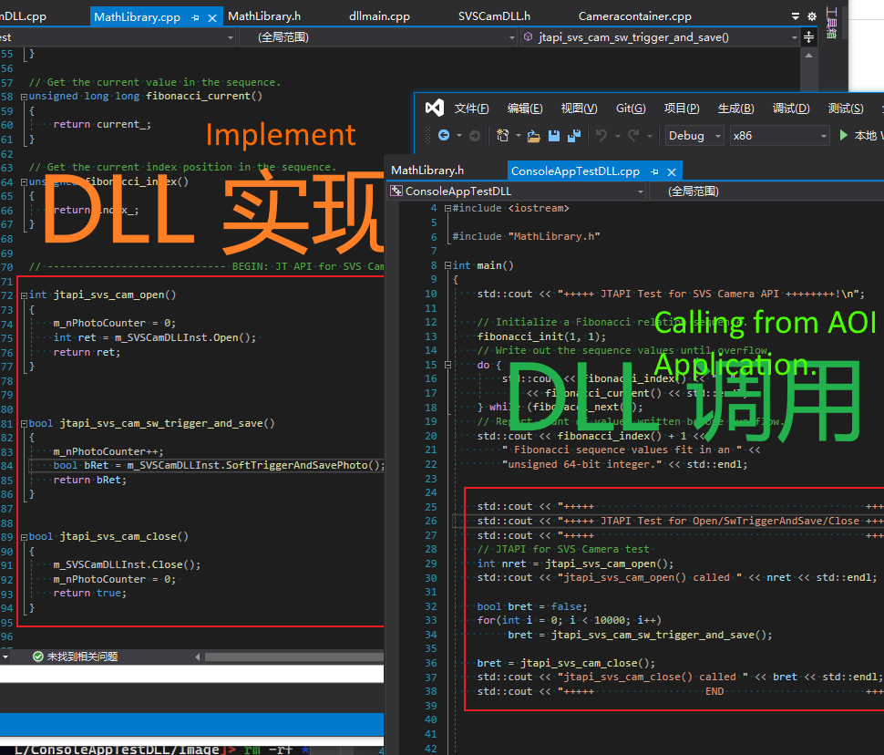
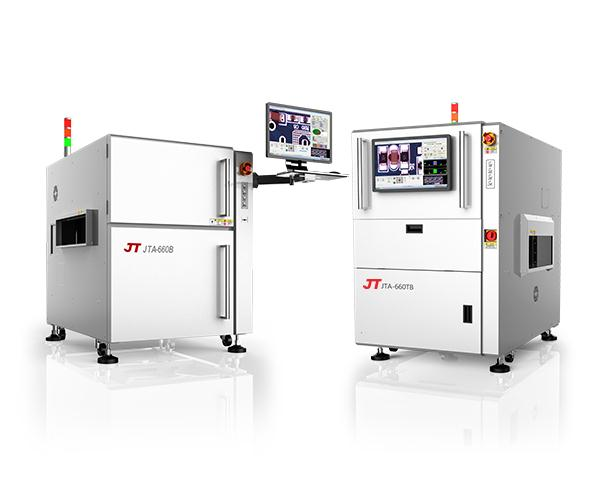
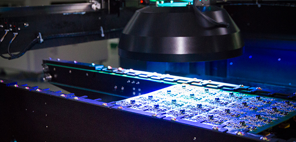

DLL Library for JT based on SVS USB3 C++ SDK
---



JT Company used a SVS USB3 Camera to equip their AOI device.

Software trigger mode is used to capture photos. For SVS camera, JT project use SVS c++ API in SVSCamDLL class and generates a svscam.dll library.

JT AOI application uses above svscam.dll to capture photos in software trigger mode.

See example below: in JT AOI application, `SoftTriggerAndSavePhoto()` is called to capture one photo.

```c++
class SVSCamDLL  
{
public:
	SVSCamDLL(); 
    virtual ~SVSCamDLL();

public:
    // Open Camera
    virtual int Open();
    // Cloase Camera
    virtual void Close();
	// SW Trigger --> WaitFor --> Get Its Image
    // Software trigger to capture one photo and save to Image folder: 
    virtual bool SoftTriggerAndSavePhoto();
  
    // SoftTriggerAndSavePhoto() function uses following three functions internally
	virtual void SoftTrigger(); 
	virtual BOOL WaitTrigerFinish();
	virtual BYTE* GetImageData();
}
```

# 1. DLL  Library Implementation

```c++
//  BEGIN: JT API for SVS Camera: Software Trigger Capture  //

int jtapi_svs_cam_open()
{
    m_nPhotoCounter = 0;
    int ret = m_SVSCamDLLInst.Open(); 
    return ret;
}


bool jtapi_svs_cam_sw_trigger_and_save()
{
    m_nPhotoCounter++;
    bool bRet = m_SVSCamDLLInst.SoftTriggerAndSavePhoto(); 
    return bRet;
}


bool jtapi_svs_cam_close()
{
    m_SVSCamDLLInst.Close();
    m_nPhotoCounter = 0; 
    return true;
}

```

DLL Library implemented in folder `JTAPI-Port-Test-DLLs-App\test-dll-svs-cam-jpapi\DllTest`. It includes above three functions.

Files includes header files and svs dll, output svscam.dll for JT:

1. JTCameraAPIHeader.h （example header files）
2. DllTest.dll （DLL file output/ svscam.dll for JT AOI application）
3. SVGenSDK.dll （32 bits SVS camera api dll）

# 2. DLL Library 

`JTAPI-Port-Test-DLLs-App\test-dll-client-app\ConsoleAppTestDLL` folder implements an console sample, which uses functions embedded in DllTest.dll library.

```c++
std::cout << "+++++                                            ++++++++!\n";
std::cout << "+++++ JTAPI Test for Open/SwTriggerAndSave/Close ++++++++!\n";
std::cout << "+++++                                            ++++++++!\n";
// JTAPI for SVS Camera test 
int nret = jtapi_svs_cam_open();
std::cout << "jtapi_svs_cam_open() called " << nret << std::endl;

bool bret = false;
for(int i = 0; i < 10000; i++)
    bret = jtapi_svs_cam_sw_trigger_and_save();

bret = jtapi_svs_cam_close();
std::cout << "jtapi_svs_cam_close() called " << bret << std::endl;
std::cout << "+++++                  END                       ++++++++!\n";
```

Above example based on DllTest.dll and capture 10000 times well in software trigger mode.


# 3. DLL Library Usage


# 4. DLL Library Implements Details
Like the implementations below：
```c++
// SoftTriggerAndSavePhoto() includes following functions
virtual void SoftTrigger(); 
virtual BOOL WaitTrigerFinish();
virtual BYTE* GetImageData();
```
We can implement other functions, such as gamma setting, exposure setting, easily.


# 5. JT AOI Application Introduction

JT AOI application uses Visual C++ 6.0 on Win 7 32 bits Windows platform. svscam.dll library above is used to communicate with SVS USB3 12MP camera in software trigger mode, with maximum 30fps.

The target PCB is inserted into the AOI machine and the AOI application captures hundreds photos. Then after the algorithms are completed, the PCB will flow out to next stage.






Inspecting flows:

1. PCB inserting into the machine from left side; (no photo capturing action)
2. Hundreds photos are captured in different color lighting on the line for different spots;
3. PCB flows out the machine from right side; (no photo capturing action)

So, SVS camera photo capturing is applied only in above `stage 2`.


# 6. Current Test Status of SVS USB3 camera application


a. Months ago, JT engineer implemented his own code to capture photos, but not stable, such as freezing in hours.

b. Several Weeks ago, JT engineer used my above svscam.dll example code, and test result is good enough for days in above `stage 2` and never encountered freezing again.

c. But weeks ago, above test failed if looping full stages, i.e. `stage 1` -> `stage 2` -> `stage 3` ->  `stage 1` -> `stage 2` -> `stage 3` ->  `stage 1` -> `stage 2` -> `stage 3` ->  `stage 1` -> `stage 2` -> `stage 3`  ->  `stage 1` -> `stage 2` -> `stage 3` -> ...

# 7. Issue
JT engineer reported the camera sometimes output black photos and if AOI application is closed, svscapture can not open the svs camera. But this only happens in full loop:

1. If only looping `stage 2` forever, with days testing, no issue found.

2. But if looping `stage 1` -> `stage 2` -> `stage 3` -> ..., then the issue happens in hours.

If fact, no photo capturing call happens in `stage 1` and `stage 3`, and also no moving with camera and its cables in  `stage 1` and `stage 3`.


