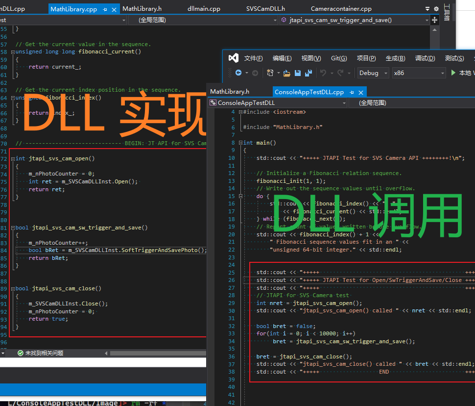

DLL 实现及应用 - JTAPI for SVS Cam
---



本问介绍JTAPI for SVS Cam实现的`SVSCamDLL.h`和`SVSCamDLL.cpp`接口函数文件在DLL库的应用实现方法：
```c++
class SVSCamDLL  
{
public:
	SVSCamDLL(); 
    virtual ~SVSCamDLL();

public:
    // 打开相机
    virtual int Open();
    // 关闭相机
    virtual void Close();
	// 软件触发拍照并保单号到Image目录: SW Trigger --> WaitFor --> Get Its Image
    virtual bool SoftTriggerAndSavePhoto();

    // SoftTriggerAndSavePhoto()由以下函数实现
	virtual void SoftTrigger(); 
	virtual BOOL WaitTrigerFinish();
	virtual BYTE* GetImageData();
}
```

# DLL 库实现

```
// ----------------------------- BEGIN: JT API for SVS Camera: Software Trigger Capture --------------------------------- //

int jtapi_svs_cam_open()
{
    m_nPhotoCounter = 0;
    int ret = m_SVSCamDLLInst.Open(); 
    return ret;
}


bool jtapi_svs_cam_sw_trigger_and_save()
{
    m_nPhotoCounter++;
    bool bRet = m_SVSCamDLLInst.SoftTriggerAndSavePhoto(); 
    return bRet;
}


bool jtapi_svs_cam_close()
{
    m_SVSCamDLLInst.Close();
    m_nPhotoCounter = 0; 
    return true;
}

```

DLL库实现在目录 `JTAPI-Port-Test-DLLs-App\test-dll-svs-cam-jpapi\DllTest`目录 中。实现了如上三个API。

生成头文件 及DLL文件 如下：
1. MathLibrary.h （包含以上三个API的头文件）
2. DllTest.dll （DLL文件，包含以上三个函数的实现）
3. SVGenSDK.dll （32位 SVS 相机库文件）

# DLL 库的使用

`JTAPI-Port-Test-DLLs-App\test-dll-client-app\ConsoleAppTestDLL`目录实现了一个命令行例程，调用以上 `DllTest.dll` 文件。

```c++
    std::cout << "+++++                                            ++++++++!\n";
    std::cout << "+++++ JTAPI Test for Open/SwTriggerAndSave/Close ++++++++!\n";
    std::cout << "+++++                                            ++++++++!\n";
    // JTAPI for SVS Camera test 
    int nret = jtapi_svs_cam_open();
    std::cout << "jtapi_svs_cam_open() called " << nret << std::endl;

    bool bret = false;
    for(int i = 0; i < 10000; i++)
         bret = jtapi_svs_cam_sw_trigger_and_save();

    bret = jtapi_svs_cam_close();
    std::cout << "jtapi_svs_cam_close() called " << bret << std::endl;
    std::cout << "+++++                  END                       ++++++++!\n";
```

以上例程调用基于  `DllTest.dll` 文件中实现在三个函数，以循环软件 触发采集 10000 次作为例子。


# DLL库及其应用


# SVS Cam其它功能实现
类似于：
```c++
	// SoftTriggerAndSavePhoto()由以下函数实现
	virtual void SoftTrigger(); 
	virtual BOOL WaitTrigerFinish();
	virtual BYTE* GetImageData();
```
可以实现诸如 曝光参数 设定，Gamma设定，等函数。

# Version 
2021年10月15日11:20:44
joe.ge@alliedvision.com


