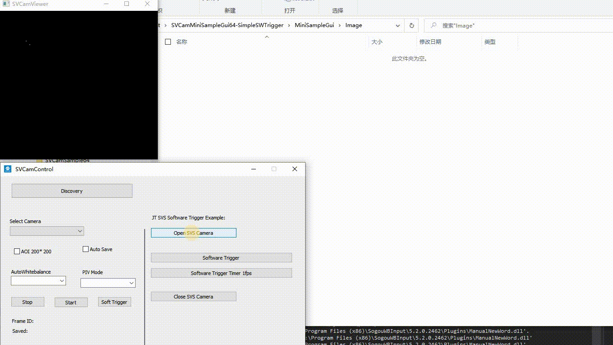
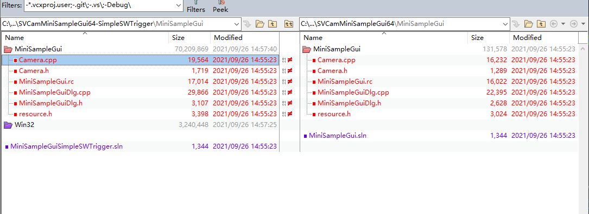

# svs_sw_trigger_auto_test
Based on SVCamMiniSampleGui64, Implement automatically software trigger testing loop and photo saving.

## Screenshot

## Modification
Original example: `SVCamMiniSampleGui64`  
Modified example: `SVCamMiniSampleGui64-SimpleSWTrigger`  
