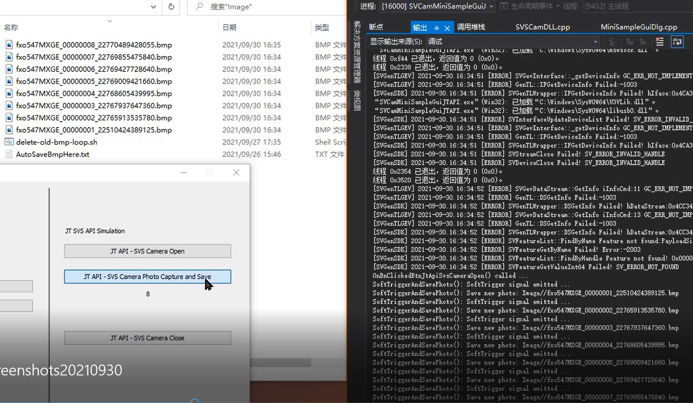

JT SVS API 实现
---

## 目标
SVS C++ API 软件 触发功能 在 JT SVS Camera 规则下的实现。

## 实现接口文件 
1. SVSCamDLL.h
2. SVSCamDLL.cpp

## 主要接口函数~

```c++
class SVSCamDLL  
{
public:
	SVSCamDLL(); 
    virtual ~SVSCamDLL();

public:
    // Open SVS Camera
    virtual int Open();
    // Close SVS Camera
    virtual void Close();

	// Emit Software 
	virtual void SoftTrigger(); 
	virtual BOOL WaitTrigerFinish();
	virtual BYTE* GetImageData();
	// Integrated Example: SW Trigger --> WaitFor --> Get Its Image
    virtual bool SoftTriggerAndSavePhoto();
}
```
以上代码 引用 到的文件 ，请原样包含到新工程。


## 使用方式1
发送SoftwareTrigger命令，并等待图片返回 ，然后将图片保存到电脑硬盘的BMP文件中：
```c++
Open();
while(1) {
	SoftTriggerAndSavePhoto();
}
Close();
```

## 使用方式2
以上功能分步实现方式：
```c++
Open();
while(1) {
	SoftTrigger(); 
	WaitTrigerFinish();
	Bitmap = GetImageData();
	Bitmap.SaveToDisk(); // 此句为示例
}
Close();
```

## 例程运行界面


分为4个按钮：
1. 第一个 Open, 打开 相机 并处理后台采集线程
2. 第二个 Capture Save, 发送软件 触发命令并保存收到 的图片
3. 第三个 Close, 关闭相机 
4. 第四表 Quit, 关闭整个程序，并做最后的资源清理工作。


